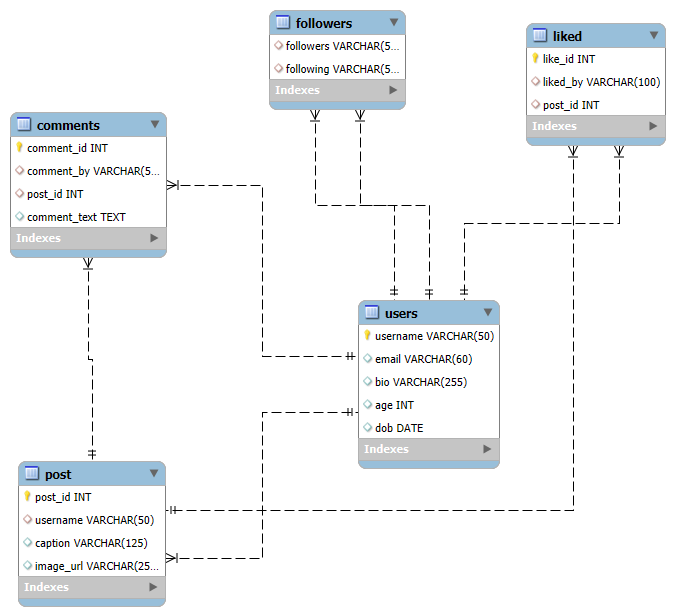

# 📸 Mini Instagram SQL Project

This is a mini version of Instagram designed using **MySQL**, focusing on database design and data handling. It includes tables for users, posts, likes, comments, and followers — just like a real social media platform.

---

## 📁 Project Files

| File Name            | Description                             |
|---------------------|-----------------------------------------|
| `database_schema.sql` | Contains all table creation statements |
| `insert_data.sql`     | Sample data for all tables             |
| `queries.sql`         | Sample SQL queries to fetch data       |
| `ERD.png`             | Visual ER diagram of the database      |

---

## 🧱 Database Tables

- **Users**: Stores user info (username, email, bio, age, DOB)
- **Post**: User posts with caption and image
- **Liked**: Tracks who liked which post
- **Comments**: Tracks comments on posts
- **Followers**: Tracks who follows whom

---

## 📷 ER Diagram

---

## 🧪 Sample SQL Queries (in `queries.sql`)

- Show all users and their posts
- Count likes on each post
- Get comments with commenter names
- List of followers for each user

---

## ✅ Status

✅ Completed core tables and relationships  
🛠 Future scope: Admin panel, login system, analytics

---

## ✨ Author

**Shrijal Mishra**  
B.Tech CSE Student  
